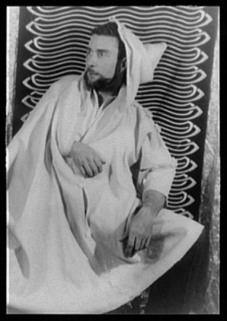
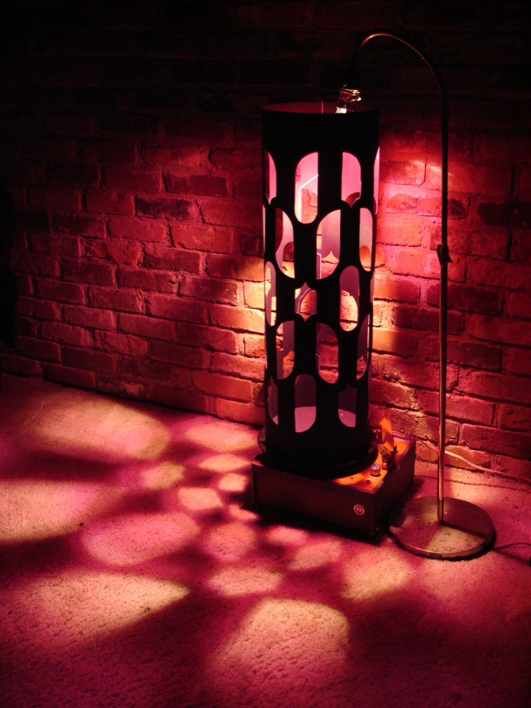
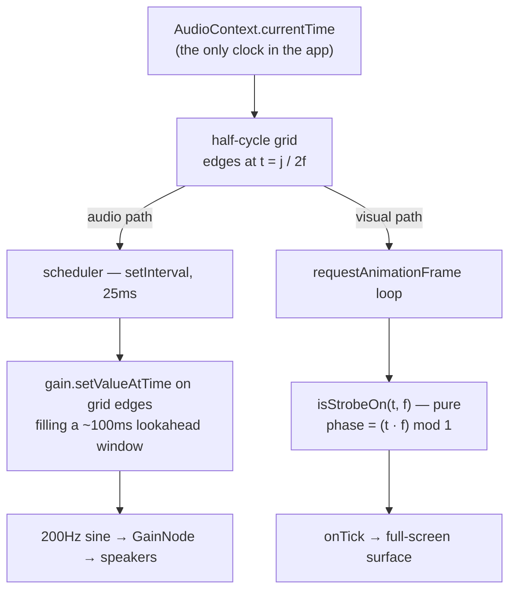

# Dreamachine

**A strobing light and a pulsing tone that cannot drift apart.**

A full-screen strobe locked to an isochronic tone, driven by a single slider from 4 to 13 Hz —
Brion Gysin's flicker machine of 1959, reduced to a web page. You use it with your eyes closed.
The screen is the lamp.

The interesting part isn't the effect. It's the word *cannot* in that first line.

> [!WARNING]
> **18+ only. Not for anyone with epilepsy, a history of seizures, or photosensitivity.
> Not a medical device.** A consent gate fronts the app, the disclaimer stays visible
> during use, and Space, Escape, or a tap anywhere halts both outputs instantly.
>
> There's no hosted demo linked here, and that's deliberate — publishing source and
> handing strangers a one-click strobe are separate decisions. Build it yourself if you
> want to try it.

---

## Where this comes from

In December 1958, Brion Gysin was dozing on a bus outside Marseilles with a low sun
strobing through a row of roadside trees. Behind his closed eyelids it broke into an
overwhelming flood of colour and pattern, and he wrote it up that night as a storm of
visions. He spent the next several years trying to get the effect back on demand.

W. Grey Walter's *The Living Brain* supplied the mechanism: flicker at roughly the brain's
own alpha rhythm drives the visual cortex into generating imagery of its own. In 1959 Ian
Sommerville — a Cambridge mathematics student, and the technical mind of the pair — built
the machine that exploited it. A cardboard cylinder with slots cut down its sides, stood on
a record turntable, a light bulb hanging inside. Spin it, sit in front of it, close your
eyes.

<p align="center">
  
  
</p>

<p align="center">
  <em>Brion Gysin in 1957, the year before the bus ride (Carl Van Vechten, Library of
  Congress) · a Dreamachine cylinder, lit (Wikimedia Commons). Both public domain.</em>
</p>

Gysin described it as the first work of art to be looked at with the eyes closed, and he
was serious about it in a way he never quite was about the cut-up technique he'd handed to
William Burroughs — "this cut-up thing is just not my bag, but this DREAMACHINE!" he wrote.
He expected it to replace television: everyone generating their own imagery instead of
receiving someone else's. He patented it in 1961, showed it in Paris in 1962, and failed
completely to sell it. The pitch to consumer electronics manufacturers went nowhere, and
the machine stayed a cult object passed between artists rather than an appliance.

It didn't stay small forever. In 2022 a full-scale reimagining ran as part of the UK's
UNBOXED programme — conceived by Jennifer Crook, with spatial design by Assemble, music by
Jon Hopkins, and a consciousness-science programme attached to it involving the
neuroscientist Anil Seth, cognitive neuroscientist David Schwartzman, and philosopher Fiona
Macpherson. Audiences sat under flickering white light with their eyes closed, in a room
built for it, while researchers studied what the brain does when you give it nothing to
look at but rhythm. Sixty years on, the premise held.

**This repo is that idea reduced to its smallest possible form:** the strobe, the tone, one
slider, no room and no turntable. And one significant departure from the original — the
widely circulated build plans put the classic 78-rpm cylinder's flicker near 20 Hz, dropping
back into the alpha band only at 45 rpm. That upper figure sits inside the range this
version deliberately refuses to enter. More on that in
[Safety as a design constraint](#safety-as-a-design-constraint).

## The invariant

Two outputs. Two clocks that aren't the same clock.

Browser audio is scheduled against the audio hardware's timeline. Animation is driven by
the display's refresh. They tick at different rates, and neither runs at exactly the rate
it advertises. Drive the light from `setInterval` and the tone from Web Audio, and they'll
agree for about a minute before walking apart — which defeats the whole device, because
the flash and the pulse are supposed to be *one event*.

The instinct is to synchronize: measure the gap, apply a correction, repeat. That's a
feedback loop, with all the tuning and overshoot that implies.

This app never synchronizes anything, because **both outputs are pure functions of the
same clock**. There's no gap to measure. Drift isn't corrected — it's unrepresentable.

## One clock, two consumers



Both paths compute pulse edges from the same expression: for frequency `f`, the edges sit
at `t = j / 2f` for integer `j`, with even `j` turning on and odd `j` turning off. The
audio scheduler walks that grid forward to place gain events; the render loop evaluates
the same grid at whatever instant the current frame lands on. Neither one is told what the
other is doing — they just can't disagree.

**That 25ms `setInterval` is not a timer for the strobe.** It decides *when to schedule*,
never *when a pulse happens*. Every audible edge is a `setValueAtTime` at an exact
grid coordinate, handed to the audio thread up to 100ms early. If the interval fires late —
and it will, it's a JS timer — the pulse still lands on the sample the grid asked for.

## The pure core

The timing logic is four small pure functions — three of them here — which is what makes the
riskiest part of the app the easiest part to test:

```ts
export function strobePhase(currentTime: number, frequencyHz: number): number {
  return (currentTime * frequencyHz) % 1;
}

/** 50% duty cycle: on for the first half of every cycle. */
export function isStrobeOn(currentTime: number, frequencyHz: number): boolean {
  return strobePhase(currentTime, frequencyHz) < 0.5;
}

/** Half-cycle boundaries: even j switches the gate ON, odd j OFF. */
export function nextHalfCycleIndex(currentTime: number, frequencyHz: number): number {
  return Math.ceil(currentTime * 2 * frequencyHz);
}
```

Everything stateful — the `AudioContext`, the oscillator, the subscriber set — is a thin
shell around these. `createStrobeEngine()` is a closure, not a class, and the entire public
surface is four methods: `start`, `stop`, `setFrequency`, `onTick`.

## The subtle part: changing frequency mid-session

Moving the slider while the strobe is running is where a naive implementation pops, stutters,
or silently desynchronizes. Three things have to happen at once: audio events already queued
on the *old* grid must be dropped, the gate has to reach whatever level the *new* grid says
it should be at right now, and scheduling has to resume on the new grid — all without an
audible click.

```ts
gateGain.gain.cancelScheduledValues(now);          // drop the old grid's future
gateGain.gain.setValueAtTime(gateGain.gain.value, now);  // anchor where we actually are
const on = isStrobeOn(now, frequencyHz);           // ask the new grid
gateGain.gain.linearRampToValueAtTime(on ? ON_GAIN : 0, now + GATE_RAMP_S);
nextHalfIndex = nextHalfCycleIndex(now + GATE_RAMP_S, frequencyHz);
```

The 3ms ramp is what makes it click-free: a gain step from 0 to 0.5 in one sample is a
discontinuity, and a discontinuity is a click. The ramp is short enough to stay imperceptible
as an *edge*, long enough to not be one as a *waveform*.

## Proving it

The invariant is stated as a claim, so it's tested as a claim. This is the test that matters
most — it takes the audio scheduler's output and asks the visual function whether it agrees:

```ts
it("agrees with isStrobeOn about state between boundaries", () => {
  for (const f of [4, 7.3, 13]) {
    const events = gateEventsInWindow(f, 0, 2);
    for (const { time, on } of events) {
      // Just after each gate edge the pure visual function must agree.
      expect(isStrobeOn(time + 1e-9, f)).toBe(on);
    }
  }
});
```

Around it: **20 unit tests** covering phase math at exact binary-representable boundaries
(the suite uses 8Hz precisely because a 0.125s period is exact in floating point, so boundary
assertions are exact rather than approximate), and **13 end-to-end tests** in Playwright
that run against the real static export — including that `AudioContext.state === "running"`
and the surface is actually toggling, that a malformed consent record re-shows the gate, and
that clicking the slider does *not* trigger the stop-anywhere handler.

Measured on a 10-minute headless run at 8Hz during the timing-validation phase:

| | |
|---|---|
| Max edge deviation | **18.2ms** |
| Mean deviation | **6.5ms** |
| Flips over the 20ms budget | **0 of 9,598** |
| Start latency | **~85–90ms** (budget: under 100ms) |

## Safety as a design constraint

Warnings are the weakest safety mechanism available — they transfer risk to the user and
call it consent. The stronger moves are the ones built into the shape of the thing:

**The 4–13 Hz range is a ceiling, not a preference.** Photosensitive response peaks in
roughly the 15–25 Hz band, and the slider's maximum stops deliberately short of it. A device
that *cannot reach* the most provocative frequencies is safer than one that can and merely
warns about it. The bound is enforced by `clampFrequency` inside both `start` and
`setFrequency` — at the engine boundary, not as the range input's `min`/`max` — so a caller
passing 40 Hz gets 13 Hz.

**The consent gate is the default, not a redirect.** The store backing it returns `false`
from `getServerSnapshot()`, so the gate is what the prerendered HTML contains. There's no
render path to the strobe that doesn't pass through a confirmed client-side consent record —
not a check that can fail open, but an absence of any other branch.

**The interrupt is default-deny.** A window-level `pointerdown` listener stops the session
on *any* tap; controls that need to survive being touched opt out with `data-stop-exempt`.
The design assumes eyes closed and fingers guessing, so everything halts the strobe except
the few things explicitly allowed not to. Space and Escape are wired at the window too, so
they work regardless of what has focus, and unmount always stops the engine.

This narrows risk; it doesn't eliminate it. Photosensitive individuals can be provoked below
15 Hz, which is exactly why the cap is layered with the gate, the persistent disclaimer, and
the interrupt rather than replacing them.

## The code

| Path | What it is |
|---|---|
| `lib/strobeEngine.ts` | The whole product. Pure timing functions + the closure that owns both outputs. |
| `lib/consent.ts` | Consent record with injected storage (testable without a browser) and a `useSyncExternalStore` store that defaults closed. |
| `hooks/useStrobeEngine.ts` | React wrapper; wires the window-level safety interrupts. |
| `components/StrobeSurface.tsx` | Full-bleed viewport surface, toggled by `onTick`. |
| `tests/`, `e2e/` | 20 Vitest unit tests, 13 Playwright e2e tests against the static export. |
| `SPEC.md` | Source of truth for requirements and architecture. |

React re-renders once per pulse edge, not once per frame — the engine dedupes `onTick`
notifications against the last emitted state, so a 60Hz render loop at 8Hz produces 16
notifications a second instead of 60.

## Running it

```sh
bun install
bun run dev        # dev server
bun run build      # static export to out/
bun run preview    # serve out/ via wrangler pages dev
bun run test       # 20 Vitest unit tests
bun run test:e2e   # build + 13 Playwright e2e tests against the export
```

Next.js (App Router, `output: "export"`) · TypeScript · Tailwind · Bun · Vitest · Playwright.
Deploys as a static export to Cloudflare Pages.

**No backend, no database, no accounts, no analytics, no third-party requests, and no network
calls at all after the initial load.** Nothing leaves the browser, because there's nowhere for
it to go. The only persisted state on the machine is one `localStorage` key holding the consent
timestamp.

## Sources and credits

History drawn from the [Wikipedia article on the
Dreamachine](https://en.wikipedia.org/wiki/Dreamachine), Flashbak's [piece on Gysin's
machine](https://flashbak.com/brion-gysins-dream-machine-the-only-work-of-art-you-look-at-with-your-eyes-closed-436094/)
(which also reproduces Charles Gatewood's 1972 photograph of Gysin and Burroughs with the
machine — worth seeing, and still in copyright, which is why it isn't shown here), the
[construction plans and background at Rex Research](https://www.rexresearch.com/gysin/gysin.htm),
and the modern project's own [about page](https://dreamachine.world/about/).

Images are public domain: the 1957 Gysin portrait is Carl Van Vechten's, held by the
[Library of Congress](https://www.loc.gov/item/2004662972/); the lit cylinder is
[from Wikimedia Commons](https://commons.wikimedia.org/wiki/File:Dreamachine_still_lit.jpg).

## License

[Apache-2.0](LICENSE) — chosen over a shorter permissive license specifically for its explicit
warranty disclaimer (§7) and limitation of liability (§8). This project flashes lights at
people; that language should be attached to it.

**No warranty of any kind.** Use it, fork it, and run it at your own risk.
